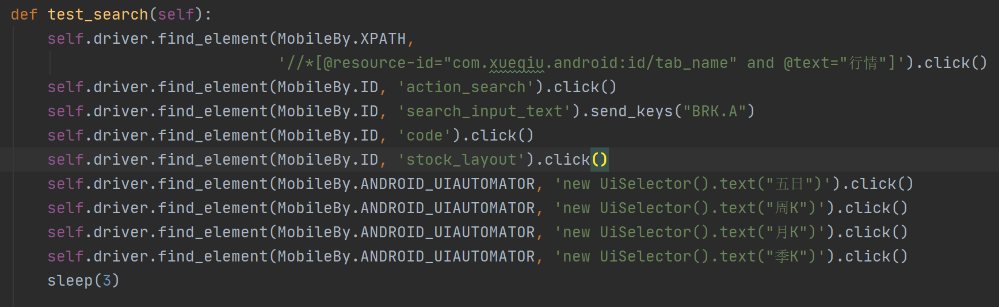
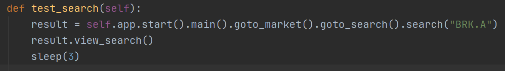

## Appium Android自动化示例

### 说明
此demo仅为了演示appium的自动化

访问[演示网站](http://www.heng.show:8080)，登录演示账号（用户名：guest、密码：password），任务列表中的AppiumDemo为本项目

- /page/*.py：page封装

- /data/*.yml：数据驱动文件

- /test_case/*.py：测试用例

根据PageObject思想，对页面的操作封装在base_page中，对元素的定位点击等操作放在yaml文件中管理

test_unused_po.py
 

->

test_used_po.py
